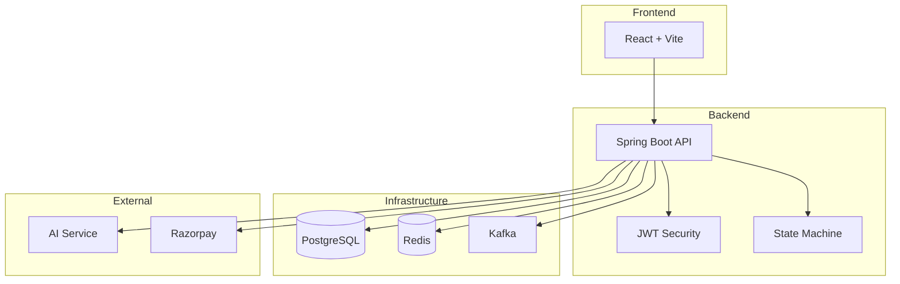
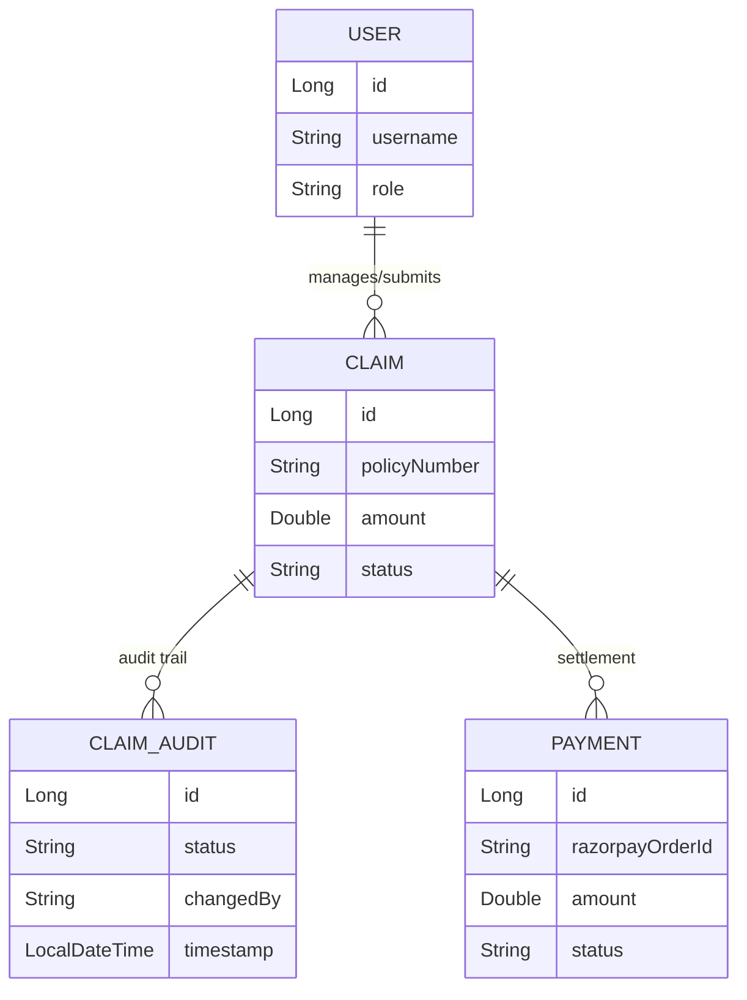
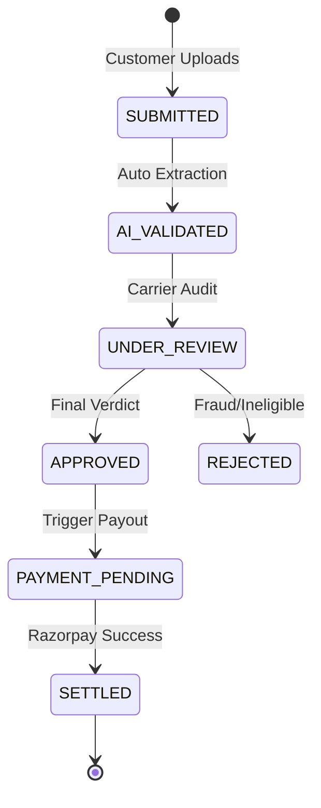

# 🛡️ Insurance Claim Processing (TPA) System

A production-grade Insurance Third Party Administrator (TPA) system built with **Spring Boot 3.4+ (JDK 25)** and **React**.

## 🚀 Key Features

- **Smart Claim Timeline**: Real-time visual audit trail of the claim lifecycle.
- **AI-Powered Validation**: Automated document extraction and risk assessment using LLMs.
- **Razorpay Integration**: Production-grade payment settlement for approved claims.
- **Role-Based Access**: Specialized dashboards for Customers, Carriers, and Admin.
- **Dockerized Infrastructure**: One-click deployment with Postgres, Redis, and Kafka.

## 🏗️ System Architecture



## 📊 Data Model (ERD)



## 🔄 Claim Lifecycle Workflow



## 🛠️ Tech Stack

- **Backend**: Spring Boot 3.4.x, Spring Security, Spring Data JPA, Spring AI.
- **Frontend**: React 18, Tailwind CSS, Framer Motion (for Timeline).
- **Middleware**: Redis (Caching), Kafka (Events), PostgreSQL (Main DB).
- **Integrations**: Razorpay (Payments), PDFBox (Doc Processing).

## 📦 Deployment (Docker)

Ensure you have your `.env` file configured with the required keys.

```bash
docker-compose up -d --build
```

Access the system at:
- Frontend: `http://localhost:3000`
- Backend API: `http://localhost:8080/swagger-ui.html`

## 🧪 Testing

The system includes 10+ new production-grade test cases covering edge cases.

```bash
mvn clean test
```
