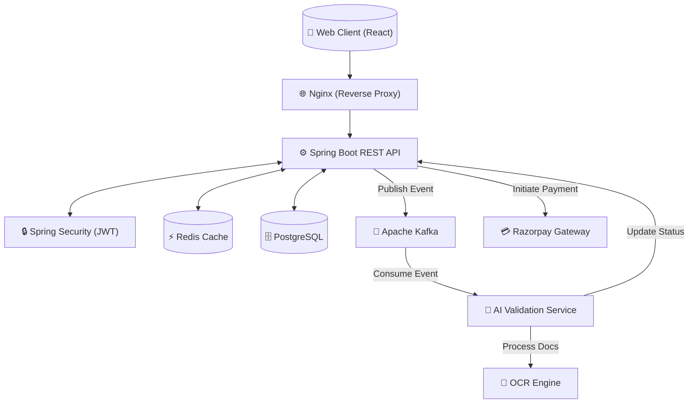
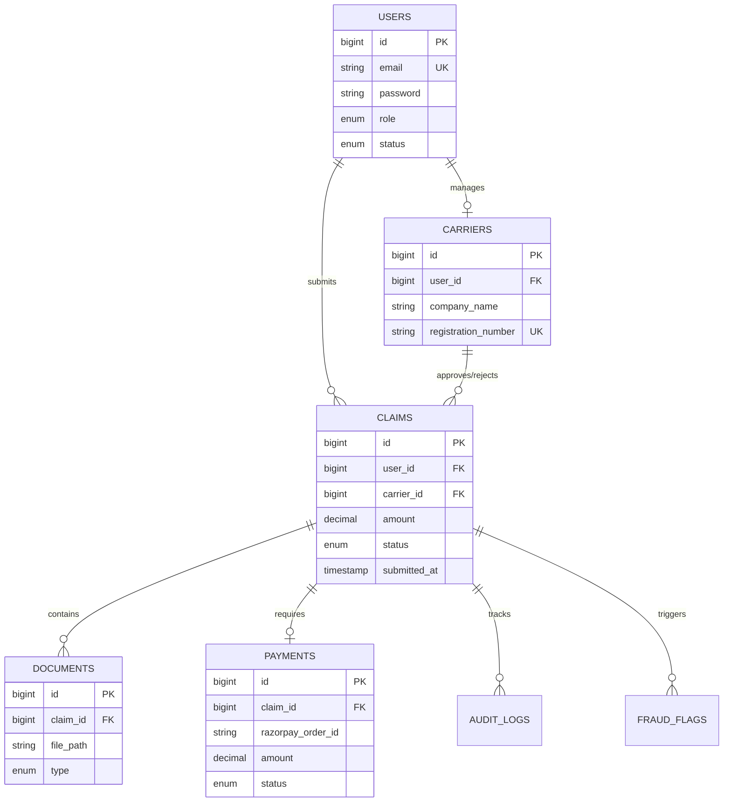
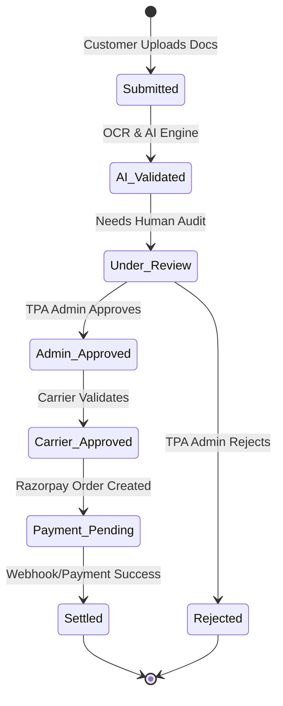
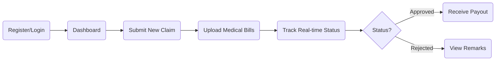
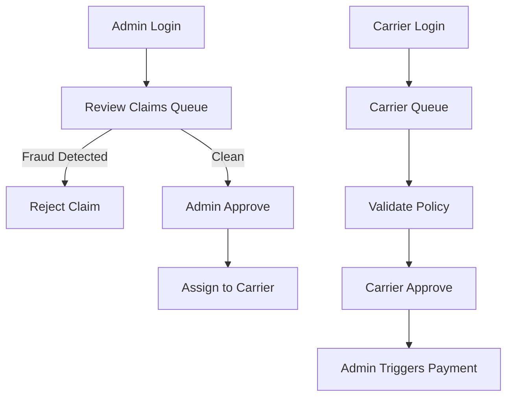
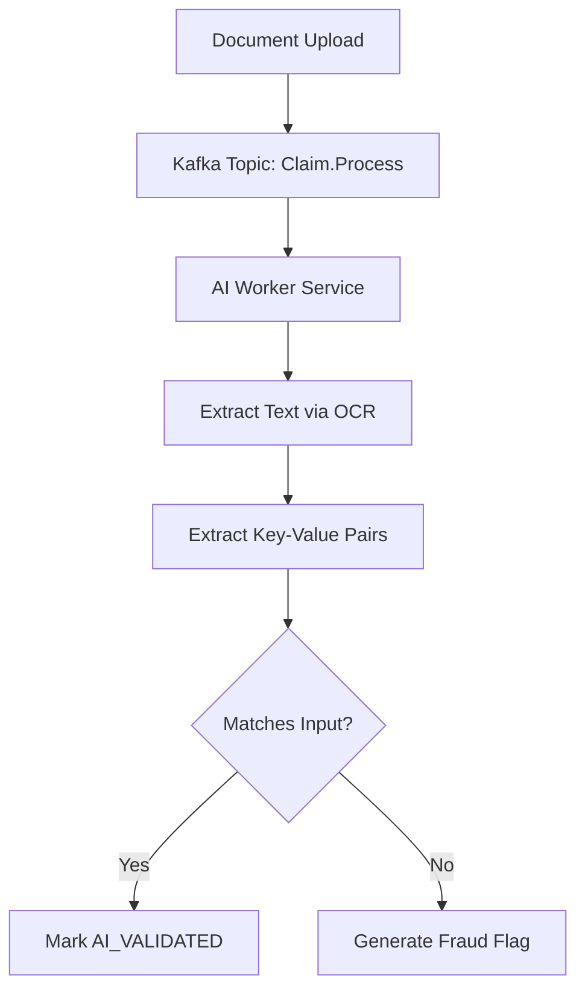
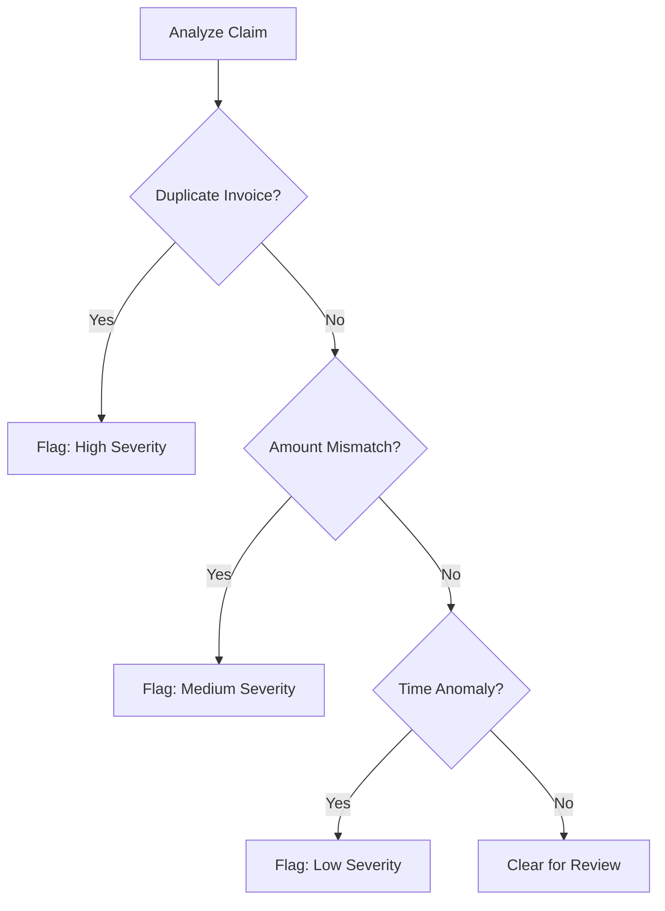
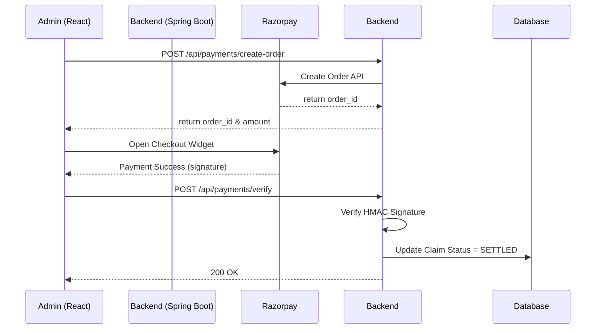
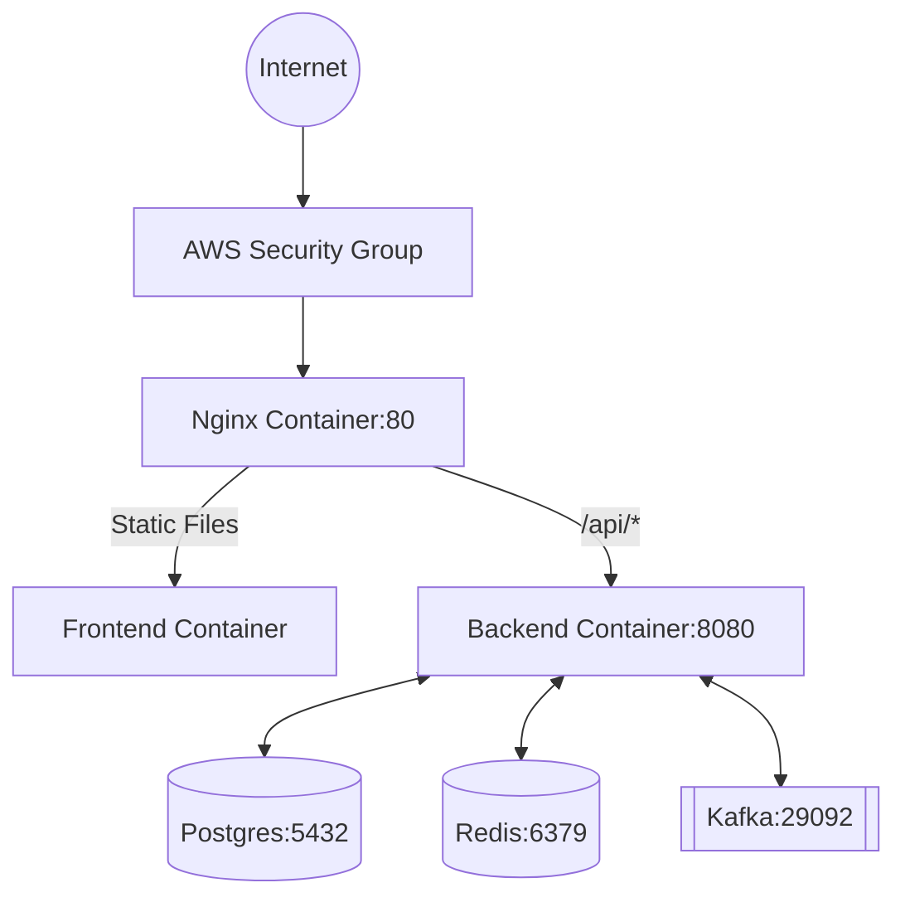

# 🏥 TPA Insurance Claim Processing System

> A next-generation, AI-powered Third-Party Administrator (TPA) platform designed to streamline healthcare insurance claims, automate fraud detection, and orchestrate secure carrier payments.

---

## 🧱 1. Tech Stack

### Backend
- **Core Framework:** Spring Boot (Java 17)
- **Security:** Spring Security with stateless JWT Authentication
- **ORM & Data Access:** Hibernate / Spring Data JPA
- **Database:** PostgreSQL 15
- **Message Broker:** Apache Kafka (Event Streaming)
- **Caching:** Redis (Performance optimization)

### Frontend
- **Framework:** React 18 (Vite)
- **Styling:** Tailwind CSS
- **Network:** Axios
- **State Management:** React Context API / Hooks

### DevOps
- **Containerization:** Docker & Docker Compose
- **Web Server / Proxy:** Nginx
- **Deployment:** AWS EC2 (Production environment)

### AI & Automation Layer
- **Validation Engine:** AI-powered rule validation and document parsing
- **OCR:** Optical Character Recognition for automated data extraction from claim forms
- **Fraud Detection:** Algorithmic risk scoring and pattern matching

---

## 🏗️ 2. System Architecture

The application follows a microservices-inspired monolithic architecture, decoupling heavy processing (like AI validation) via Kafka event streams.

---

## 🗄️ 3. Database Design

The relational database is normalized to 3NF to ensure data integrity and strict audit compliance.

### Core Tables & Schema

| Table Name | Primary Key | Foreign Keys | Key Constraints | Description |
|---|---|---|---|---|
| **`users`** | `id` (BIGINT) | None | `email` (UNIQUE), `mobile` (UNIQUE) | Core identity table storing credentials, roles, and status. |
| **`claims`** | `id` (BIGINT) | `user_id` (FK), `carrier_id` (FK) | `status` (CHECK ENUM) | The central entity representing a submitted insurance claim. |
| **`carriers`** | `id` (BIGINT) | `user_id` (FK) | `registration_number` (UNIQUE) | Insurance carrier profiles associated with an admin user. |
| **`documents`** | `id` (BIGINT) | `claim_id` (FK) | `type` (CHECK ENUM) | Metadata and paths to files uploaded for a claim. |
| **`payments`** | `id` (BIGINT) | `claim_id` (FK) | `razorpay_order_id` (UNIQUE) | Financial transactions tied to a claim settlement. |
| **`audit_logs`** | `id` (BIGINT) | `claim_id` (FK) | `action` (VARCHAR) | Immutable ledger tracking all status transitions and edits. |
| **`fraud_flags`** | `id` (BIGINT) | `claim_id` (FK) | `severity` (INT) | AI-generated anomalies and risk scores for manual review. |

---

## 📊 4. Entity Relationship (ER) Diagram

---

## 🔁 5. Application Workflow

### Claim Lifecycle Flow

---

## 👤 6. User Flow Diagrams

### Customer Flow

### Admin & Carrier Flow

---

## 🤖 7. AI Validation Flow

The AI layer reduces human workload by automatically parsing documents and checking for discrepancies before human intervention.

- **Document Parsing:** OCR extracts text from medical bills and prescriptions.
- **Field Extraction:** NLP models identify Patient Name, Dates, Diagnosis, and Total Amount.
- **Cross-validation:** The system compares extracted fields against user-inputted claim data.
- **Fraud Detection Signals:** Automatically flags claims with mismatched dates or inflated amounts.

---

## 🚨 8. Fraud Detection Flow

The fraud detection system uses deterministic algorithms and AI risk scoring to protect the carrier.

- **Amount Mismatch:** Claimed amount differs from OCR extracted amount.
- **Date Inconsistency:** Discharge date is before admission date.
- **Duplicate Claims:** Identical invoice numbers submitted previously.
- **Suspicious Patterns:** High frequency of claims from the same user.

---

## 💳 9. Payment Flow (Razorpay)

Payments are securely orchestrated through the Razorpay integration using server-to-server verification.

1. **Create Order:** Admin triggers payment; Backend calls Razorpay API to generate an `order_id`.
2. **Payment UI:** Frontend renders Razorpay checkout widget.
3. **Verify Payment:** Razorpay success callback sends `payment_id` and `signature` to the backend.
4. **Update Status:** Backend verifies the HMAC SHA256 signature and marks claim as `SETTLED`.

---

## 🔐 10. Security Architecture

- **JWT Authentication:** Stateless, short-lived access tokens with secure HttpOnly refresh tokens (planned).
- **Role-based Access Control (RBAC):** Strict endpoint protection utilizing `@PreAuthorize` annotations for `CUSTOMER`, `FMG_ADMIN`, and `CARRIER_USER`.
- **API Protection:** Global Exception Handling prevents stack-trace leakage.
- **Data Isolation:** Carriers can only view claims explicitly assigned to them via `carrier_id`.
- **Password Hashing:** BCrypt algorithm with a strength factor of 10.

---

## 📡 11. API Design

| Method | Endpoint | Role | Description |
|---|---|---|---|
| `POST` | `/api/v1/auth/register` | `PUBLIC` | Register a new user |
| `POST` | `/api/v1/auth/login` | `PUBLIC` | Authenticate and return JWT |
| `POST` | `/api/v1/claims` | `CUSTOMER` | Submit a new insurance claim |
| `GET`  | `/api/v1/claims/{id}` | `CUSTOMER` / `ADMIN` | Fetch claim details |
| `POST` | `/api/v1/claims/{id}/upload` | `CUSTOMER` | Upload medical documents |
| `GET`  | `/api/v1/admin/claims` | `FMG_ADMIN` | Paginated list of all claims |
| `POST` | `/api/v1/admin/claims/review`| `FMG_ADMIN` | Approve or reject a claim |
| `PUT`  | `/api/v1/claims/{id}/carrier-approve` | `CARRIER_USER` | Carrier final approval |
| `POST` | `/api/v1/payments/create-order`| `FMG_ADMIN` | Initiate Razorpay order |
| `POST` | `/api/v1/payments/verify` | `FMG_ADMIN` | Validate Razorpay signature |

---

## 🧪 12. Testing Strategy

Quality assurance is guaranteed through a multi-tiered testing strategy:
- **Unit Testing:** JUnit 5 and Mockito are used extensively in the Service and Repository layers to ensure business logic validity.
- **Integration Testing:** Spring Boot `@WebMvcTest` and `@SpringBootTest` with an H2 in-memory database to test slice contexts without heavy Docker dependencies.
- **E2E Testing:** Playwright is configured for browser automation to verify critical user flows (Login -> Submit Claim -> Approve).
- **AI Validation Testing:** Dedicated test cases verifying OCR fallback logic and threshold configurations.

---

## 🚀 13. Deployment Architecture

The application is fully containerized and ready for cloud deployment.

- **Docker Containers:** Separate containers for Frontend, Backend, Postgres, Redis, and Kafka.
- **Nginx Reverse Proxy:** Routes `/api` traffic to the backend and serves static React assets.
- **Environment Variables:** All secrets (DB credentials, Razorpay keys, OpenAI keys) are injected at runtime via `.env`.
- **AWS EC2 Deployment:** The provided `deploy.sh` script automates the process of pulling code, building images, and starting the `docker-compose` network on a Linux instance.

---

## 📈 14. Future Enhancements

- **Real-time Notifications:** WebSockets/Server-Sent Events for instant claim status updates on the frontend.
- **ML-based Fraud Scoring:** Implement Python-based scikit-learn models consuming Kafka streams for predictive fraud analysis.
- **RazorpayX Payouts:** Fully automate the disbursement of funds directly to the customer's bank account upon carrier approval.
- **Mobile Application:** React Native client leveraging the existing robust REST API.
